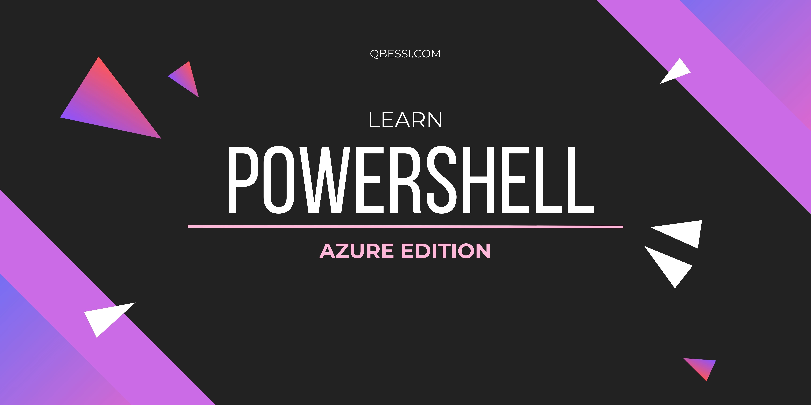

1. **Resource Group Creation**  
   Write a script to automatically create multiple resource groups in specified locations.

2. **Virtual Machine Deployment**  
   Create a script that provisions virtual machines with predefined configurations and images.

3. **Virtual Machine Scaling**  
   Develop a script to automatically scale virtual machines based on CPU usage metrics.

4. **Resource Group Deletion**  
   Write a script to remove resource groups and all their resources based on specific criteria.

5. **Storage Account Management**  
   Create a script to automate the creation and deletion of storage accounts.

6. **Blob Upload**  
   Develop a script that uploads files from a local directory to a specified Azure Blob container.

7. **Blob Backup**  
   Create a script that regularly backs up blobs from one container to another.

8. **Virtual Network Setup**  
   Write a script that automates the creation of virtual networks and subnets based on user input.

9. **Network Security Group Rules**  
   Develop a script that applies or updates multiple NSG rules in bulk.

10. **Public IP Address Allocation**  
    Create a script that provisions public IP addresses for a set of virtual machines automatically.

11. **SQL Database Provisioning**  
    Write a script to create multiple Azure SQL databases with predefined settings.

12. **Function App Deployment**  
    Create a script that deploys Azure Function Apps from a specified source code repository.

13. **Azure Logic App Creation**  
    Develop a script to set up Azure Logic Apps with defined workflows and triggers.

14. **Key Vault Secret Management**  
    Write a script to automatically store and retrieve secrets in Azure Key Vault.

15. **Resource Monitoring**  
    Create a script that sets up alerts and logs for resource usage metrics in Azure.

16. **Role Assignments**  
    Develop a script to assign roles to users or groups across multiple Azure resources.

17. **Azure DevOps Pipeline Triggers**  
    Write a script to set up triggers for Azure DevOps pipelines based on specific events.

18. **Azure Policy Assignments**  
    Create a script that assigns Azure policies across subscriptions to enforce compliance.

19. **Resource Tagging**  
    Develop a script that applies tags to resources based on naming conventions or resource types.

20. **Security Audits**  
    Write a script to regularly audit Azure resources for compliance with security best practices.

21. **Backup for Azure SQL Database**  
    Create a script that configures automated backups for Azure SQL Databases.

22. **Application Insights Setup**  
    Develop a script to provision Application Insights for monitoring application performance.

23. **Container Deployment**  
    Write a script that deploys Docker containers to Azure Container Instances.

24. **Azure Virtual Desktop Provisioning**  
    Create a script to set up and configure Azure Virtual Desktop environments.

25. **Firewall Rules for Azure SQL**  
    Develop a script that configures firewall rules for Azure SQL Database access.

26. **Azure Function Triggers**  
    Write a script to set up timers and triggers for Azure Functions.

27. **Load Balancer Configuration**  
    Create a script that provisions and configures Azure Load Balancers for traffic distribution.

28. **API Management Setup**  
    Develop a script to set up Azure API Management with predefined APIs and policies.

29. **Resource Inventory Reporting**  
    Write a script that generates a report of all resources in the subscription.

30. **VM Image Creation**  
    Create a script to automate the creation of images from existing virtual machines.

31. **Service Health Alerts**  
    Develop a script to set up alerts for Azure service health issues.

32. **Application Deployment**  
    Write a script that deploys applications to Azure App Services.

33. **Traffic Manager Configuration**  
    Create a script to configure Azure Traffic Manager profiles for load balancing.

34. **Dev/Test Environment Setup**  
    Develop a script to quickly provision development and testing environments.

35. **Azure Functions with CI/CD**  
    Write a script that integrates Azure Functions with CI/CD pipelines for automated deployment.

36. **Azure AD User Creation**  
    Create a script that automates the bulk creation of Azure Active Directory users.

37. **Resource Cleanup**  
    Develop a script to identify and delete unused resources in Azure.

38. **Multi-Region Deployments**  
    Write a script to deploy resources across multiple Azure regions for redundancy.

39. **Network Peering Setup**  
    Create a script that automates the peering of virtual networks.

40. **Key Vault Access Policies**  
    Develop a script to set and update access policies for Azure Key Vault.

41. **Event Grid Subscriptions**  
    Write a script to configure Event Grid subscriptions for resource events.

42. **Azure Data Factory Pipelines**  
    Create a script to deploy and manage Azure Data Factory pipelines.

43. **Conditional Access Policies**  
    Develop a script to configure conditional access policies in Azure AD.

44. **Resource Migrations**  
    Write a script to facilitate the migration of resources between subscriptions.

45. **Azure Monitor Alerts**  
    Create a script that sets up alerts in Azure Monitor for resource metrics.

46. **Scale Set Management**  
    Develop a script to manage virtual machine scale sets based on load.

47. **Disaster Recovery Plans**  
    Write a script that configures disaster recovery settings for Azure resources.

48. **User Role Review**  
    Create a script to periodically review and report on user roles and permissions.

49. **Cost Management Reports**  
    Develop a script that generates reports on Azure spending and resource usage.

50. **Scheduled Tasks in Azure**  
    Write a script that creates and manages scheduled tasks for Azure resources.
